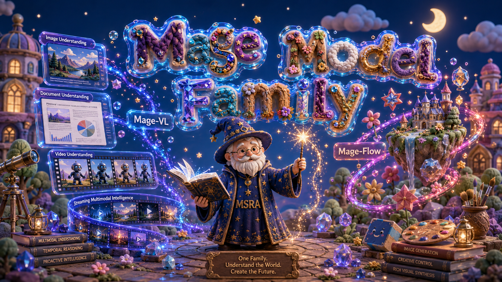

## Independent reproduction: codec-native video efficiency

**Paper:** [Mage-VL: An Efficient Codec-Native Streaming Multimodal Foundation Model (arXiv:2607.24904)](https://arxiv.org/abs/2607.24904)<br>
**Assessment:** **Partially reproduced.**

We tested the claim that codec-guided patch selection removes at least 75% of visual tokens while preserving video understanding and lowering latency. On 36 questions from eight licensed public Perception Test videos, HEVC `tc8` used **1,152 tokens versus 96,512** for uniform 64-frame processing over the same source horizon: **98.81% fewer** than dense processing, above the paper's “over 75%” claim, with **71.68×** lower warm preprocessing-inclusive latency and 72.2% versus 75.0% accuracy (paired Δ −2.8 pp, 95% CI −11.1 to 5.6). However, the approximately token-matched stress test used 12,672 versus 12,064 tokens and reached 69.4% versus 80.6% while taking 2.42× longer, so this bounded setup did not show the paper's fixed-budget accuracy/latency effect. DCVC-RT and HEVC both scored 26/36 without retraining, preserving the alternate-codec trend.

This is a preregistered public slice rather than the paper's full NExT-QA protocol: it uses the released Mage-VL checkpoint, Mage-VL's own uniform processor rather than Qwen3-VL, greedy decoding, and question-level paired bootstrapping. All experiments ran on **Kubernetes** with **NVIDIA RTX PRO 6000 Blackwell** GPUs, four allocated per experiment, **16 GPUs peak concurrent**, over **0.40 hours actual campaign wall time**.

[Read the illustrated report](reports/mage-vl-codec-reproduction/report.md) · [inspect aggregated results](artifacts/mage-vl-codec-reproduction/results.json) · [open the self-contained notebook](notebooks/mage_vl_reproduction.py)

[](https://molab.marimo.io/github/alphaXiv/mage-7255fc67/blob/main/notebooks/mage_vl_reproduction.py)

### Experiment log

Every experiment used the exact run command shown below; branches preserve the code that produced each frozen measurement.

| Branch / experiment | Purpose or change | Exact run command | Assessment / outcome | Compute |
|---|---|---|---|---|
| `main` | Public landing page and synthesis | Not run as an experiment (publication surface) | Presentation only | — |
| [`full-perception-tc8`](https://github.com/alphaXiv/mage-7255fc67/tree/orx/full-perception-tc8) | Primary 36-question tc8 comparison | `bash repro/run.sh` | 90.45% fewer tokens, 6.76× faster; −8.33 pp accuracy | Kubernetes, 4× RTX PRO 6000 Blackwell, 3.10 min |
| [`tc4`](https://github.com/alphaXiv/mage-7255fc67/tree/orx/tc4-perception-budget) | Low-budget frontier | `bash repro/run.sh` | 90.45% fewer, 5.21× faster; −5.56 pp | Kubernetes, 4× RTX PRO 6000 Blackwell, 2.03 min |
| [`tc16`](https://github.com/alphaXiv/mage-7255fc67/tree/orx/tc16-perception-budget) | Mid-budget frontier | `bash repro/run.sh` | 90.45% fewer, 6.91× faster; −2.78 pp | Kubernetes, 4× RTX PRO 6000 Blackwell, 4.28 min |
| [`tc32`](https://github.com/alphaXiv/mage-7255fc67/tree/orx/tc32-perception-budget) | High-budget frontier | `bash repro/run.sh` | 90.45% fewer, 6.39× faster; +2.78 pp | Kubernetes, 4× RTX PRO 6000 Blackwell, 6.15 min |
| [`matched-duration`](https://github.com/alphaXiv/mage-7255fc67/tree/orx/dense64-matched-duration) | tc8 versus dense uniform64 over the same source horizon | `bash repro/run.sh` | 98.81% fewer, 71.68× faster; −2.78 pp | Kubernetes, 4× RTX PRO 6000 Blackwell, 13.57 min |
| [`token-matched`](https://github.com/alphaXiv/mage-7255fc67/tree/orx/token-matched-tc84) | Approximately equal measured-token stress test | `bash repro/run.sh` | −11.11 pp and 2.42× slower; effect not shown | Kubernetes, 4× RTX PRO 6000 Blackwell, 3.93 min |
| [`DCVC validation A`](https://github.com/alphaXiv/mage-7255fc67/tree/orx/dcvc-validation-half), [`B`](https://github.com/alphaXiv/mage-7255fc67/tree/orx/dcvc-train-half) | Alternate-codec evaluation across disjoint video halves | `bash repro/run.sh` | Combined DCVC-RT = HEVC = 26/36 | Kubernetes, 4× RTX PRO 6000 Blackwell, 2.47 / 2.30 min |
| [`medium-duration`](https://github.com/alphaXiv/mage-7255fc67/tree/orx/medium-duration-control) | 60/120-second licensed-video diagnostic | `bash repro/run.sh` | 96.41% token reduction; timing diagnostic only | Kubernetes, 4× RTX PRO 6000 Blackwell, 1.40 min |
| [`timing-repeat`](https://github.com/alphaXiv/mage-7255fc67/tree/orx/tc8-independent-timing-replicate) | Independent tc8 timing repeat | `bash repro/run.sh` | 6.54× versus 6.76× primary speedup | Kubernetes, 4× RTX PRO 6000 Blackwell, 2.88 min |

Re-render the five evidence figures with `python3 reproduction/analyze.py`. The notebook is validated with `marimo check notebooks/mage_vl_reproduction.py`; opening it does not rerun expensive model inference.

---

<div align="center">

# Mage: A Lightweight, Research-Friendly Multimodal Model Family

<p>
  <b>Microsoft Mage Team</b>
</p>

<p>
  <a href="https://microsoft.github.io/Mage"></a>
  &nbsp;
  <a href="https://github.com/microsoft/Mage"></a>
  &nbsp;
  <a href="https://huggingface.co/collections/microsoft/mage"></a>
  &nbsp;
  <a href="LICENSE"></a>
  &nbsp;
  <a href="https://www.apache.org/licenses/LICENSE-2.0"></a>
  &nbsp;
  <a href="https://opensource.org/licenses/MIT"></a>
  &nbsp;
  <a href="https://arxiv.org/abs/2607.19064"></a>
  &nbsp;
  <a href="https://arxiv.org/abs/2607.24904"></a>
</p>


</div>

<div align="center">

</div>

---

**Mage** is a family of lightweight, research-friendly multimodal models built at a fixed **4B-parameter** budget. It is designed to make advanced visual **understanding** and **generation** accessible for controlled experiments, post-training research, and vertical-domain applications under realistic compute budgets.

The family is organized around a shared **codec-aligned efficiency** philosophy — *spend representation capacity where the signal is* — applied to both the understanding and the generation side:

| Model | Task | Scale | Code | Report |
| :--- | :--- | :---: | :--- | :--- |
| **[Mage-VL](mage_vl/)** | Image & video understanding, proactive streaming | 4B | [`mage_vl/`](mage_vl/README.md) | [arXiv](https://arxiv.org/abs/2607.24904) |
| **[Mage-Flow](mage_flow/)** | Text-to-image generation & instruction-based editing | 4B | [`mage_flow/`](mage_flow/README.md) | [arXiv](https://arxiv.org/abs/2607.19064) |

Both models are compact enough to train, fine-tune, and deploy on modest hardware, yet remain competitive with much larger open systems in their respective domains.

---

## 🧩 Mage-VL — efficient codec-native proactive streaming understanding

**Mage-VL** is a codec-native, proactive-streaming multimodal foundation model for image & video understanding, whose visual encoder (**Mage-ViT**) is trained **entirely from scratch** and paired with a Qwen3-4B decoder at a compact **4B** scale. Targeting a modern *Moravec's paradox* of VLMs — strong complex reaasoning, fail and slow at real-time perception — it cuts visual tokens by **over 75%** for **up to 3.5× wall-clock inference speedup**. A **single** released checkpoint simultaneously provides image & video understanding **and** the proactive streaming gate — one model, no separate variants.

**Highlights**

- **Codec-native & from scratch.** The whole visual stack is trained from scratch; the bio-inspired I/P predictive-patch mechanism (`16×16`) cuts visual-token use by **over 75%** (**~1/8 or less** of dense frame sampling), enabling **8× longer** video training and **up to 3.5×** inference speedup.
- **Matched-LLM video gains.** With the 4B Qwen3 backbone fixed, swapping in Mage-ViT beats Qwen3-VL-4B on **every** reported video & temporal-grounding benchmark (e.g. **+22.5** QVHighlight, **+11.0** VSI-Bench).
- **Strong for its size.** On par with Qwen3-VL-4B on static images, and clearly ahead on video understanding and spatial intelligence (**+11.0** VSI-Bench, **+53.1** CrossPoint, **+5.2** EmbSpatial).
- **Proactive streaming, single model.** A frozen-backbone cognition gate delivers low-latency, event-gated commentary and generalizes to real 2026 World Cup broadcasts.
- **Seven empirical findings** on data efficiency, resolution scaling, codec acceleration, VideoQA-SFT redundancy, motion–spatial synergy, AI4AI data pipelines, and Zero-Vision SFT for multimodal RL.

→ Details, installation, inference, and proactive streaming: **[`mage_vl/README.md`](mage_vl/README.md)**

## 🎨 Mage-Flow — efficient native-resolution generation & editing

**Mage-Flow** is a compact 4B generative stack for **text-to-image generation** and **instruction-based image editing**, built from two co-designed components: **Mage-VAE** (a lightweight, high-fidelity latent tokenizer) and a **Native-Resolution Multimodal Diffusion Transformer** trained with rectified flow matching. Each task ships in **Base**, **RL-aligned**, and **4-step Turbo** variants.

**Highlights**

- **Compact & competitive.** A single 4B family for generation *and* editing that matches or beats much larger open systems (Qwen-Image 20B, Z-Image 6B, FLUX.2 32B, FireRed-Image-Edit 20B).
- **Efficient tokenizer.** Mage-VAE matches FLUX.2-VAE reconstruction fidelity using **~12× / ~22× fewer encode / decode MACs per pixel**, removing the VAE high-resolution bottleneck.
- **Native resolution.** One checkpoint generates from **512 to 2048** on any aspect ratio, including extreme **4:1** (e.g. `512×2048`, `2048×512`).
- **System-level speed.** Native-resolution packing + fused CUDA kernels cut per-step training time from **~1.93 s → ~0.78 s** (**~2.5× faster training**); at `1024²` on a single A100, **Mage-Flow-Turbo 0.59 s/image** and **Mage-Flow-Edit-Turbo 1.02 s/edit**.
- **Versatile editing.** Mage-Flow-Edit supports semantic content editing, appearance transformation, image restoration, and structure-aware outputs within a unified image-and-text-conditioned model.

→ Details, installation, Python API, CLI, and Gradio app: **[`mage_flow/README.md`](mage_flow/README.md)**

## 📣 News

- **2026-07-26** — **Mage-VL** released on 🤗 [Hugging Face](https://huggingface.co/microsoft/Mage-VL): a single codec-native checkpoint for image & video understanding **with** a built-in proactive streaming gate, alongside the standalone [Mage-ViT](https://huggingface.co/microsoft/Mage-ViT) visual encoder (ViT pre-training only).
- **2026-07-22** — **Mage-Flow** checkpoints released on 🤗 [Hugging Face](https://huggingface.co/collections/microsoft/mage): Base, RL-aligned, and 4-step Turbo variants for both text-to-image generation and image editing.

## 📥 Model Zoo

**Mage-VL** — vision–language (image & video understanding). A single checkpoint bundles the understanding backbone and the proactive streaming gate. We also release the standalone visual encoder, **Mage-ViT** (ViT pre-training only — no VLM joint training).

| Model | Task | Hugging Face |
| :--- | :--- | :--- |
| `Mage-VL` | image & video understanding **+** proactive streaming gate | [🤗 microsoft/Mage-VL](https://huggingface.co/microsoft/Mage-VL) |
| `Mage-ViT` | codec-native visual encoder (ViT pre-training only) | [🤗 microsoft/Mage-ViT](https://huggingface.co/microsoft/Mage-ViT) |

**Mage-Flow** — generation & editing. Each checkpoint is a self-contained diffusers-style repo (`transformer/` + shared `vae/`, `text_encoder/`, `scheduler/`).

| Model | Task | Variant | Steps | Hugging Face |
| :--- | :--- | :--- | :---: | :--- |
| `Mage-Flow-4B-Base` | text→image | Base | 30 | [🤗 microsoft/Mage-Flow-Base](https://huggingface.co/microsoft/Mage-Flow-Base) |
| `Mage-Flow-4B` | text→image | RL-aligned | 20 | [🤗 microsoft/Mage-Flow](https://huggingface.co/microsoft/Mage-Flow) |
| `Mage-Flow-4B-Turbo` | text→image | Few-step distilled | 4 | [🤗 microsoft/Mage-Flow-Turbo](https://huggingface.co/microsoft/Mage-Flow-Turbo) |
| `Mage-Flow-Edit-4B-Base` | editing | Base | 30 | [🤗 microsoft/Mage-Flow-Edit-Base](https://huggingface.co/microsoft/Mage-Flow-Edit-Base) |
| `Mage-Flow-Edit-4B` | editing | RL-aligned | 30 | [🤗 microsoft/Mage-Flow-Edit](https://huggingface.co/microsoft/Mage-Flow-Edit) |
| `Mage-Flow-Edit-4B-Turbo` | editing | Few-step distilled | 4 | [🤗 microsoft/Mage-Flow-Edit-Turbo](https://huggingface.co/microsoft/Mage-Flow-Edit-Turbo) |

## 🚀 Usage

Each model is self-contained in its own directory with a dedicated README:

- **Mage-VL** — image/video understanding demo, codec backends, CLI → **[`mage_vl/README.md`](mage_vl/README.md)**
- **Mage-Flow** — installation, Python API, CLI, prompt enhancement, Gradio app → **[`mage_flow/README.md`](mage_flow/README.md)**

## 📝 Citation

```bibtex
@article{yang2026magevl,
  title={Mage-VL: An Efficient Codec-Native Streaming Multimodal Foundation Model},
  author={Yang, Senqiao and Zhang, Kaichen and Jia, Zhaoyang and Guo, Jinghao and Shen, Yifei and Zhang, Xinjie and Zhang, Xiaoyi and Wang, Haoqing and Li, Xiao and Zhang, Peng and An, Xiang and Xie, Yin and Liu, Zhening and Guo, Xun and Li, Jiahao and Zheng, Shicheng and Wang, Jinglu and Guo, Zongyu and Xie, Wenxuan and Zheng, Zihan and Luo, Yuxuan and Li, Bin and Lu, Yan},
  journal={arXiv preprint arXiv:2607.24904},
  year={2026}
}

@article{zhang2026mageflow,
  title={Mage-Flow: An Efficient Native-Resolution Foundation Model for Image Generation and Editing},
  author={Zhang, Xinjie and Zhang, Peng and Zheng, Shicheng and Guo, Jinghao and Jia, Zhaoyang and Shen, Yifei and Guo, Xun and Luo, Yuxuan and Li, Jiahao and Xie, Wenxuan and Pu, Fanyi and Zhang, Xiaoyi and Zhang, Kaichen and Guo, Zongyu and Bi, Tianci and Gui, Dongnan and Liu, Zhening and Wen, Zimo and Zheng, Zihan and Yang, Senqiao and Li, Xiao and Wang, Jinglu and Li, Bin and Lu, Yan},
  journal={arXiv preprint arXiv:2607.19064},
  year={2026}
}
```

## Responsible AI

These models are released for research purposes only and are not intended for product or service deployment. Responsible AI considerations were incorporated throughout the development process, including data selection, model training, and evaluation. The training data includes a combination of public, licensed, and internal datasets that were processed to remove clearly identifiable personal information and reduce harmful content where possible. However, as the data is largely sourced from web-scale collections, it may contain biases or uneven representation. As a result, the models may generate outputs that are inaccurate, biased, or inappropriate under certain prompts. The models should be used in controlled research settings with appropriate human oversight, and downstream users are responsible for applying additional safeguards — such as content moderation, validation, and compliance checks — before broader use.

## License

Licensing is per-model:

| Model | License |
| :--- | :--- |
| **Mage-VL** | [Apache-2.0](https://www.apache.org/licenses/LICENSE-2.0) |
| **Mage-ViT** | [MIT](LICENSE) |
| **Mage-Flow** | [MIT](LICENSE) |
