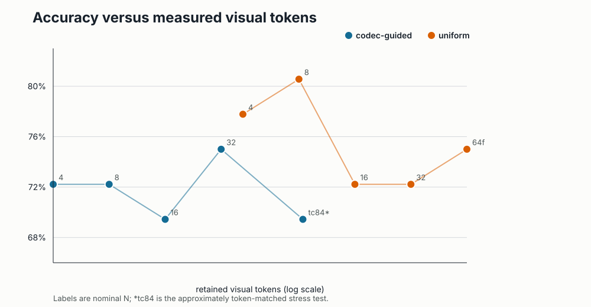
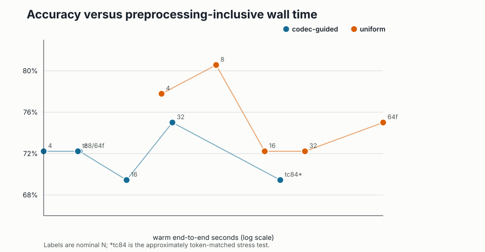
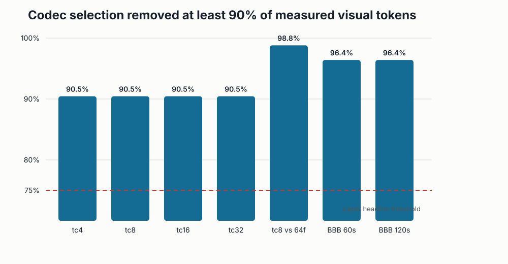
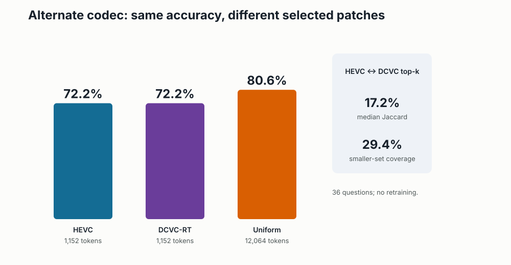
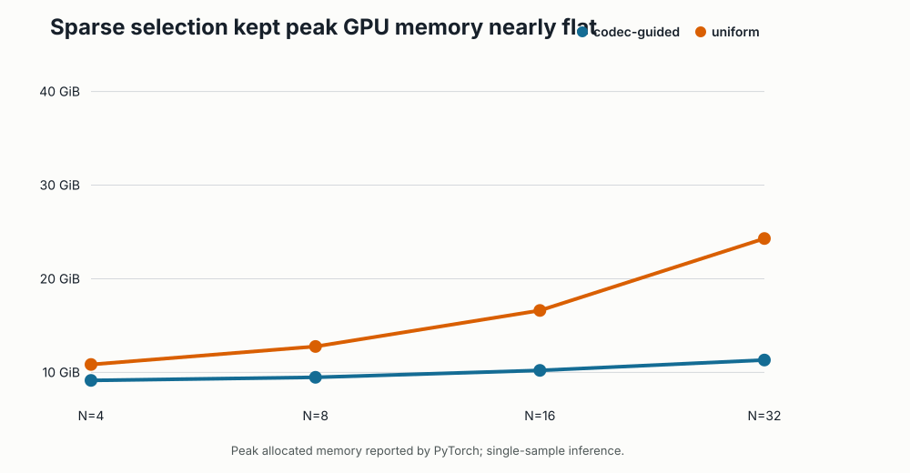

# Mage-VL codec-native video reproduction

Video-language models normally inspect many nearly redundant image patches, making longer videos expensive. Mage-VL instead asks the video codec which regions changed and spends model tokens there. We tested whether that everyday idea actually saved tokens and time without sacrificing answers, including when the codec changed.

## Verdict

**Partially reproduced.** On 36 questions from eight real Perception Test videos, HEVC-guided selection removed **98.8%** of measured visual tokens at matched 64-frame duration and was **71.7×** faster end to end, while its accuracy was 2.8 percentage points lower with a paired 95% interval spanning zero. But an approximately token-matched stress test did **not** preserve accuracy or latency; DCVC-RT did preserve the sparse accuracy–efficiency trend.

How to read this figure: farther left means fewer retained visual tokens and higher means more correct answers. The codec path occupies the low-token region, but the small sample produces a jagged accuracy curve; the `tc84*` point is the deliberately difficult approximately token-matched comparison.

 
[Open the self-contained notebook in Molab](https://molab.marimo.io/github/alphaXiv/mage-7255fc67/blob/main/notebooks/mage_vl_reproduction.py) · [aggregated measurements](../../artifacts/mage-vl-codec-reproduction/results.json)

## What was tested

We evaluated the released `microsoft/Mage-VL` checkpoint on the licensed public `lmms-lab/PerceptionTest` sample split: eight 25–35 second videos and 36 multiple-choice questions. Every paired comparison used identical clips and prompts. Codec conditions selected patch positions from HEVC or the repository’s bundled DCVC-RT path; uniform conditions used the checkpoint’s ordinary frame processor.

Runs used single-sample inference after warm-up. We recorded retained visual tokens, codec/model preprocessing, generation time, preprocessing-inclusive latency, peak allocated GPU memory, and exact-match option correctness. Confidence intervals use 10,000 paired question-level bootstrap resamples (seed `260724904`). A separate non-accuracy diagnostic used the Creative Commons Big Buck Bunny video at 60 and 120 seconds.

All observed results ran on **Kubernetes** with **NVIDIA RTX PRO 6000 Blackwell** GPUs, four GPUs allocated per experiment, **16 GPUs peak concurrent**, and **0.40 hours actual campaign wall time** from first launch to final completion.

## Claim-by-claim evidence

| Claim | Paper result | Observed result | Assessment |
|---|---|---|---|
| Matched duration removes ≥75% of tokens | “over 75%,” about one-eighth or less | tc8 vs 64 uniform frames: **98.81% fewer** tokens (1,152 vs 96,512), **71.68×** faster, accuracy 72.2% vs 75.0% (Δ −2.8 pp, 95% CI −11.1 to 5.6) | **Aligned** on this slice |
| Fixed-token accuracy with lower latency | Table 5: tc8 80.8 vs uniform 79.8 on NExT-QA, 415 vs 1,460 s | Approximately matched: tc84 12,672 tokens vs uniform8 12,064; accuracy **69.4% vs 80.6%** (Δ −11.1 pp, CI −22.2 to −2.8), and **2.42× slower** | **Inconclusive for the paper protocol; this setup did not show the effect** |
| Alternate codec preserves trend | HEVC 58.0 vs DCVC 57.7 average score; DCVC used 92% as many canvases | Full slice: HEVC **26/36**, DCVC-RT **26/36**, both 1,152 tokens; uniform 29/36 at 12,064 tokens | **Aligned downstream**, despite modest patch-set overlap |

The fixed-token row is intentionally not replaced by the more favorable matched-duration result. Its codec condition spans up to 672 source frames, unlike uniform8, and therefore adds codec work; it is a conservative stress test rather than an exact reconstruction of the paper’s canvas-budget protocol.

## Accuracy, latency, and robustness

Across nominal budgets N=4, 8, 16, and 32, codec selection was **5.2–6.9×** faster preprocessing-inclusive. At N=32 it reached 75.0% versus uniform’s 72.2%, but the paired accuracy interval (−5.6 to 13.9 pp) remained wide. An independent tc8 timing repeat gave 6.54× versus 6.76× originally.

The measured reduction was 90.45% for each like-N comparison, 98.81% against 64 dense frames over the same source horizon, and 96.41% on both 60- and 120-second diagnostics. These checks support the systems claim beyond the short benchmark clips; the medium-video control is not evidence about question accuracy.

HEVC and DCVC-RT tied exactly over all 36 questions without retraining. Their selected top-k patch sets were not literal replicas: median Jaccard overlap was only 17.3% and median smaller-set coverage 29.4%. The result supports robustness of the downstream trend, not codec-invariant rankings.

Sparse peak memory rose from 9.15 to 11.32 GiB across N=4→32, while uniform processing rose from 10.84 to 24.30 GiB. A deterministic answer-option rotation reproduced the tc8 correctness totals exactly, reducing concern that the gap was caused by option-position bias.

## Implementation and limits

The public harness follows the repository path: decode a fixed source-frame horizon, obtain HEVC/DCVC patch importance, pack the selected patches into Mage canvases, call `MageVLForConditionalGeneration.generate`, and count visual embeddings from the prepared model input. Figure generation is reproducible with `python3 reproduction/analyze.py`; expensive inference is preserved on the linked experiment branches: [tc8](https://github.com/alphaXiv/mage-7255fc67/tree/orx/full-perception-tc8), [budget sweep](https://github.com/alphaXiv/mage-7255fc67/tree/orx/tc32-perception-budget), [matched duration](https://github.com/alphaXiv/mage-7255fc67/tree/orx/dense64-matched-duration), [token-matched stress test](https://github.com/alphaXiv/mage-7255fc67/tree/orx/token-matched-tc84), and [DCVC validation](https://github.com/alphaXiv/mage-7255fc67/tree/orx/dcvc-validation-half).

This is a bounded public slice, not a headline benchmark replication. It uses Mage-VL’s own uniform path rather than Qwen3-VL, one checkpoint, greedy decoding, and question-level rather than video-level resampling. A full test needs the paper’s exact NExT-QA preprocessing, more videos, repeated decoding seeds where applicable, and throughput measurements at the paper’s batch and hardware scale.
